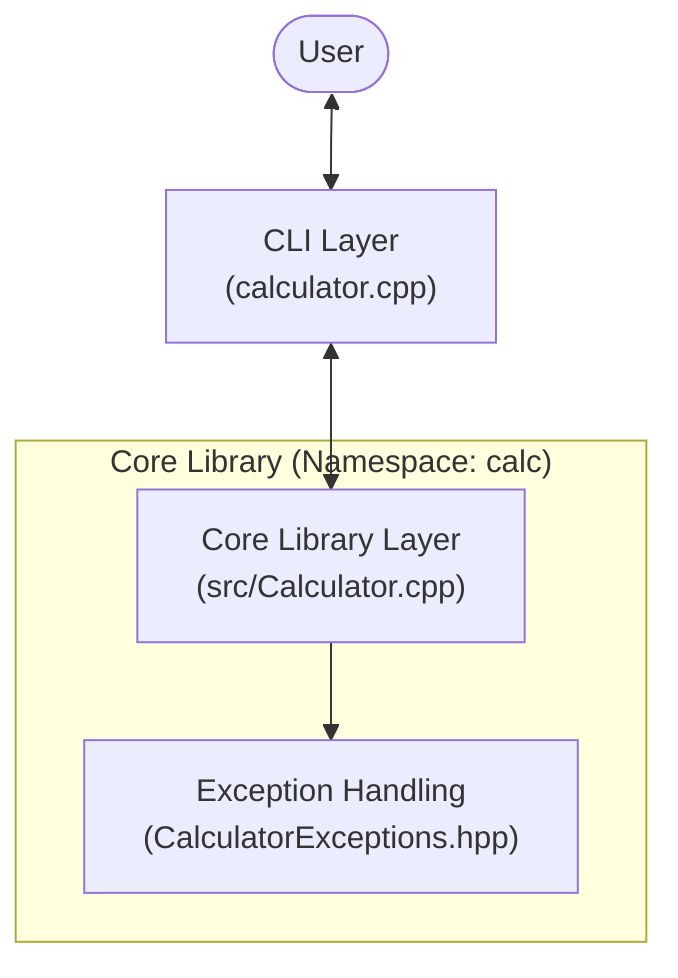

# Enterprise-Level Calculator (C++)

## About
This is a production-ready, modular calculator application implemented in C++. It follows industry standards for clean architecture, robust error handling, and maintainable project structure.

## Features
- **Modular Design**: Separated concerns into a core library and a CLI front-end.
- **Robust Error Handling**: Custom exception hierarchy within a dedicated namespace (`calc`).
- **High Precision**: Uses `double` precision for all arithmetic operations.
- **Input Validation**: Guaranteed safe execution through rigorous input sanitization.
- **Unit Tested**: Comprehensive test suite covering success paths and edge cases.
- **Automated CI/CD**: GitHub Actions workflow for continuous integration.
- **Code Style**: Strictly enforced Google C++ style via `.clang-format`.
- **Professional Build System**: Managed via CMake for cross-platform compatibility.

## System Architecture

The application is built on a Layered Architecture pattern to ensure strict separation of concerns.



## API Documentation

The core logic is available as a reusable library in the `calc` namespace.

### `calc::Calculator`
The main class performing arithmetic operations.

| Method | Signature | Description | Throws |
|--------|-----------|-------------|--------|
| `add` | `double add(double a, double b)` | Returns the sum of `a` and `b`. | None |
| `subtract` | `double subtract(double a, double b)` | Returns `a` minus `b`. | None |
| `multiply` | `double multiply(double a, double b)` | Returns the product of `a` and `b`. | None |
| `divide` | `double divide(double a, double b)` | Returns `a` divided by `b`. | `calc::DivisionByZeroException` |

### Exception Handling
All exceptions inherit from `calc::CalculatorException` (which inherits from `std::runtime_error`).
- `calc::DivisionByZeroException`: Thrown when attempting to divide by zero.
- `calc::InvalidOperatorException`: Thrown by the CLI when an unknown operator is entered.

## Development & Contribution

### Building form Source
1. **Clone**: `git clone https://github.com/iammohith/Calculator-Using-C-Plus-Plus.git`
2. **Build**:
   ```bash
   mkdir build && cd build
   cmake ..
   cmake --build .
   ```

### Running Tests
We use CTest for unit testing.
```bash
cd build
ctest --output-on-failure
```

### Coding Standards
This project adheres to **Google C++ Style**.
- Run `clang-format -i src/*.cpp include/*.hpp` before committing.
- Ensure all new methods have Doxygen comments.

## Numerical Stability Notes
- Operations are performed using `double` precision (IEEE 754).
- Overflow/Underflow behavior follows standard C++ rules (typically resulting in `inf` or `-inf`).
- Division by zero is strictly trapped and throws an exception.

## License
Distributed under the MIT License. See `LICENSE` for more information.


